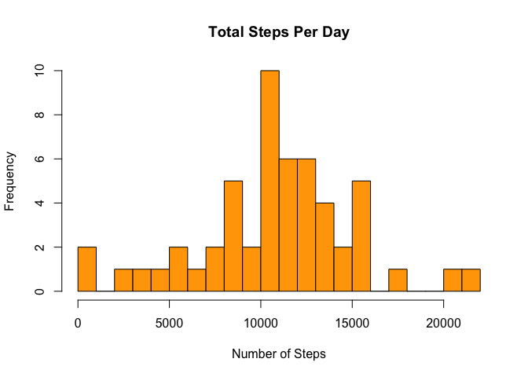
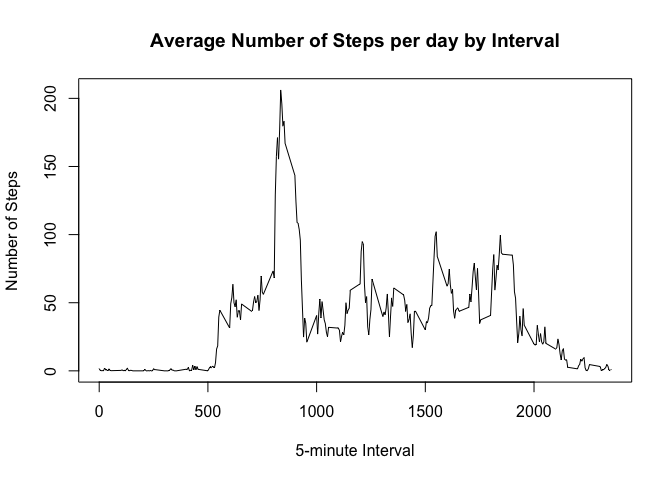
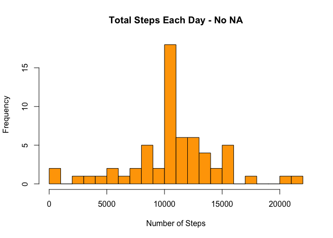
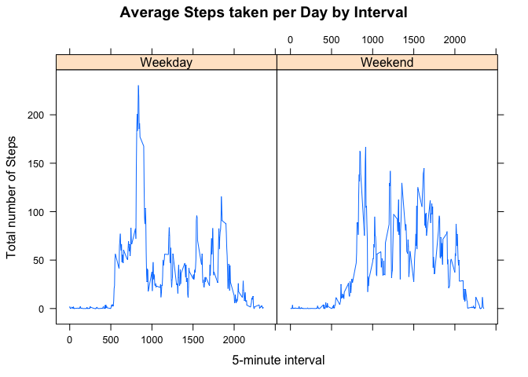

Data Load
=========

    data <- read.csv("./Data/activity.csv")

Sum steps by day
================

    stepsSum <- aggregate(steps ~ date, data, sum)

    #Histogram steps per day
    hist(stepsSum$steps, 
         main = paste("Total Steps Per Day"), 
         xlab="Number of Steps",
         col="orange", 
         breaks = 20)

    #Mean and Median
    stepsMean <- mean(stepsSum$steps)
    stepsMean

    ## [1] 10766.19

    stepsMedian <- median(stepsSum$steps)
    stepsMedian

    ## [1] 10765

    #Average steps for each interval for all days
    stepsIntervalMean <- aggregate(steps ~ interval, data, mean)

    plot(stepsIntervalMean$interval,
         stepsIntervalMean$steps, 
         type="l", 
         xlab="5-minute Interval", 
         ylab="Number of Steps",
         main="Average Number of Steps per day by Interval")

    #Find interval with most average steps
    maxInterval <- stepsIntervalMean[which.max(stepsIntervalMean$steps),1]
    maxInterval

    ## [1] 835

the total number of missing values in the dataset
=================================================

    dataNA <- sum(is.na(data$steps))
    dataNA

    ## [1] 2304

    #Missing values were imputed by inserting the average for each interval
    dataNoNa <- transform(data, 
                          steps = ifelse(is.na(data$steps), 
                                         stepsIntervalMean$steps[match(data$interval,stepsIntervalMean$interval)], 
                                         data$steps))

    stepsNoNaSum <- aggregate(steps ~ date, dataNoNa, sum)
    stepsNoNaSum

    ##          date    steps
    ## 1  2012-10-01 10766.19
    ## 2  2012-10-02   126.00
    ## 3  2012-10-03 11352.00
    ## 4  2012-10-04 12116.00
    ## 5  2012-10-05 13294.00
    ## 6  2012-10-06 15420.00
    ## 7  2012-10-07 11015.00
    ## 8  2012-10-08 10766.19
    ## 9  2012-10-09 12811.00
    ## 10 2012-10-10  9900.00
    ## 11 2012-10-11 10304.00
    ## 12 2012-10-12 17382.00
    ## 13 2012-10-13 12426.00
    ## 14 2012-10-14 15098.00
    ## 15 2012-10-15 10139.00
    ## 16 2012-10-16 15084.00
    ## 17 2012-10-17 13452.00
    ## 18 2012-10-18 10056.00
    ## 19 2012-10-19 11829.00
    ## 20 2012-10-20 10395.00
    ## 21 2012-10-21  8821.00
    ## 22 2012-10-22 13460.00
    ## 23 2012-10-23  8918.00
    ## 24 2012-10-24  8355.00
    ## 25 2012-10-25  2492.00
    ## 26 2012-10-26  6778.00
    ## 27 2012-10-27 10119.00
    ## 28 2012-10-28 11458.00
    ## 29 2012-10-29  5018.00
    ## 30 2012-10-30  9819.00
    ## 31 2012-10-31 15414.00
    ## 32 2012-11-01 10766.19
    ## 33 2012-11-02 10600.00
    ## 34 2012-11-03 10571.00
    ## 35 2012-11-04 10766.19
    ## 36 2012-11-05 10439.00
    ## 37 2012-11-06  8334.00
    ## 38 2012-11-07 12883.00
    ## 39 2012-11-08  3219.00
    ## 40 2012-11-09 10766.19
    ## 41 2012-11-10 10766.19
    ## 42 2012-11-11 12608.00
    ## 43 2012-11-12 10765.00
    ## 44 2012-11-13  7336.00
    ## 45 2012-11-14 10766.19
    ## 46 2012-11-15    41.00
    ## 47 2012-11-16  5441.00
    ## 48 2012-11-17 14339.00
    ## 49 2012-11-18 15110.00
    ## 50 2012-11-19  8841.00
    ## 51 2012-11-20  4472.00
    ## 52 2012-11-21 12787.00
    ## 53 2012-11-22 20427.00
    ## 54 2012-11-23 21194.00
    ## 55 2012-11-24 14478.00
    ## 56 2012-11-25 11834.00
    ## 57 2012-11-26 11162.00
    ## 58 2012-11-27 13646.00
    ## 59 2012-11-28 10183.00
    ## 60 2012-11-29  7047.00
    ## 61 2012-11-30 10766.19

    hist(stepsNoNaSum$steps, 
         main = paste("Total Steps Each Day - No NA"), 
         xlab="Number of Steps", 
         col="orange", 
         breaks = 20)

    #No NA Data - mean and median

    NoNaMean <- mean(stepsNoNaSum$steps)
    NoNaMean

    ## [1] 10766.19

    NoNaMedian <- median(stepsNoNaSum$steps)
    NoNaMedian

    ## [1] 10766.19

    #Calculate difference between imputed and non-imputed data.

    diffMean <- stepsMean - NoNaMean
    diffMean

    ## [1] 0

    diffMedian <- stepsMedian - NoNaMedian
    diffMedian

    ## [1] -1.188679

    #Calculate total difference
    diffTotal <- sum(stepsSum$steps) - sum(stepsNoNaSum$steps)
    diffTotal

    ## [1] -86129.51

new field for weekday and weekend
=================================

    weekend <- c("Saturday", "Sunday")
    dataNoNa$dow <- as.factor(ifelse(is.element(weekdays(as.Date(dataNoNa$date)),
                                                    weekend), "Weekend", "Weekday"))

    stepsbyIntervalDow <- aggregate(steps ~ interval + dow, dataNoNa, mean)

    #Make a panel plot containing a time series plot
    library(lattice)
    xyplot(stepsbyIntervalDow$steps ~ stepsbyIntervalDow$interval|stepsbyIntervalDow$dow, 
           main="Average Steps taken per Day by Interval",
           xlab=" 5-minute interval", 
           ylab="Total number of Steps",
           layout=c(2,1), 
           type="l")

